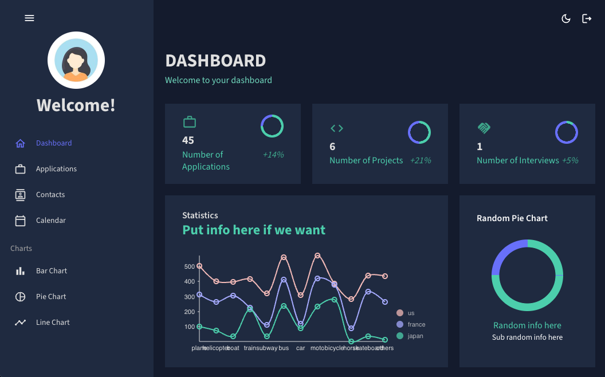

# ZEST - A React Job Tracker

Zest is a React job tracker. It allows users to create an account and save jobs to their profile. Users can also update their calendar with important events, their contacts and their profile picture.

- React
- Apollo
- MongoDB
- Mongoose
- Material UI

[This is an external link to the 'Zest' repository](https://github.com/pchandler858/zest)

## Description

We were motivated to create a job tracking app because we wanted to create a tool that would help us organize our job search. Zest allows us to save jobs, contacts, and events to a calendar. This prevents us from applying to the same job twice and allows us to keep track of our progress.

## Installation

NA

## Usage and Testing

To use Zest, create an account and login. Once logged in, you can add jobs, contacts, and events to your profile. You can also update your profile picture.

Future updates will include a more robust editing and job tracking system.

[This is an external link to 'Zest' hosted on Heroku](#)

## Credits

This app was built by the following developers:

- pchandler858
- AlexDCP
- rhodemc
- CH3RNAND3Z
- Cxxrupt

## License

This project is licensed by MIT. Please refer to the documentation in the repo.
